

  
  
  

  
  
  

---

## 📊 Sobre o Repositório: De Dados a Decisões Estratégicas

Bem-vindo ao meu portfólio de **Data Science e Business Analytics**. 

Este repositório documenta minha jornada de evolução analítica, consolidando conhecimentos adquiridos!

O objetivo principal deste espaço não é apenas demonstrar proficiência técnica em ferramentas como Power BI, Power Query e DAX, mas sim comprovar a capacidade de traduzir dados brutos em **insights acionáveis** e orientados à resolução de problemas reais de negócio. Cada projeto aqui estruturado segue a premissa de que a tecnologia é apenas o meio; o fim é a tomada de decisão inteligente.

---

## 📂 Portfólio de Projetos e Laboratórios

Abaixo está o índice das análises desenvolvidas. Clique nos links para acessar os arquivos originais.

### 🧪 Lab 01: Análise Exploratória de Vendas Globais
**Arquivos:** [`Dashboard (.pbix)`](./Lab01/Lab1.pbix) | [`Visualização do Dashboard (.png)`](./Lab01/Lab1.png)

Este laboratório introdutório foca na construção de um panorama executivo (Overview) para uma empresa multinacional fictícia, com o objetivo de responder a perguntas de negócios essenciais sobre faturamento e distribuição geográfica.

**1. Contexto de Negócio**
Diretores comerciais precisam de respostas rápidas sobre a saúde financeira da empresa. O foco aqui é a **Análise Descritiva**: entender o que aconteceu nas vendas globais, identificando quais categorias de produtos impulsionam a receita e como as prioridades de entrega impactam o volume de vendas por região.

**2. Conceito Teórico Essencial**
* **Análise Exploratória de Dados (EDA):** Utilização de métricas de agregação (soma e média) para resumir grandes volumes de dados.
* **Geolocalização Analítica:** Mapeamento espacial para facilitar a identificação visual de clusters de alta rentabilidade. 

**3. Aplicação Prática no Power BI**
* **Métricas de Faturamento:** Criação de *Cards* para visualizar o Valor Total Vendido.
* **Distribuição Categórica:** Gráficos de barras para comparar o volume de vendas entre categorias de produtos de forma decrescente (Facilitando a leitura do Princípio de Pareto).
* **Matriz de Prioridade:** Tabelas/Matrizes cruzando as vendas por País com a variável categórica de Prioridade de Entrega.
* **Média Estatística Simples:** Cálculo da média de descontos aplicados, segmentada por subcategoria.
* **Visualização Geoespacial:** Uso do visual de Mapa para plotar os países de acordo com a magnitude da média do valor de venda.
* **Interatividade (Filtros contextuais):** Implementação de *Slicers* (Segmentadores de dados) permitindo ao usuário final fatiar o relatório por Ano, Segmento e País.

**4. Insight Analítico Gerado**
A estrutura construída permite que o tomador de decisão identifique rapidamente gargalos geográficos de vendas, avalie a política de descontos por subcategoria e ajuste estratégias de estoque com base na demanda categórica e prioridades de envio.

  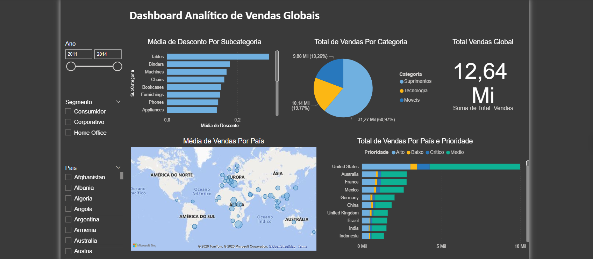

---

### 🧪 Lab 02: Modelagem, Limpeza de Dados e Inteligência com DAX
**Arquivos:** [`Dashboard (.pbix)`](./Lab02/Lab2.pbix) | [`Visualização do Dashboard (.png)`](./Lab02/Lab2.png)

Neste laboratório, o foco avança para a engenharia analítica e a lógica de negócios. Além de responder a perguntas gerenciais, o projeto demonstra o tratamento prévio dos dados, a estruturação de relacionamentos (cardinalidade) e a introdução à linguagem DAX para criação de métricas financeiras customizadas.

**1. Contexto de Negócio**
A diretoria precisa ir além do faturamento bruto. O foco agora é entender a **Lucratividade** e a **Eficiência Logística**. O negócio estabeleceu uma meta clara (Valor médio de venda de 350) e precisa monitorar se as operações de envio estão corroendo as margens de lucro ao longo do tempo.

**2. Conceito Teórico Essencial**
* **ETL e Qualidade de Dados:** O uso do Power Query para higienização dos dados antes da modelagem garante que a análise não seja distorcida por dados sujos ou nulos.
* **Modelagem Relacional (Cardinalidade):** Estruturação correta de como as tabelas se conversam (ex: 1 para Muitos) para que os filtros funcionem perfeitamente.
* **Métricas vs. Colunas Calculadas (DAX):** Entendimento de quando calcular valores linha a linha (como o Lucro por transação) e quando usar agregações dinâmicas (como a Margem de Lucro geral).

**3. Aplicação Prática no Power BI**
* **Transformação de Dados:** Uso de recursos de limpeza do Power BI para padronizar as fontes de dados.
* **Visualização de Fluxo (Gráfico de Cascata):** Implementado para entender a composição do Total de Vendas quebrado por Modo de Envio, mostrando como cada modalidade soma ao total.
* **Distribuição Proporcional (Treemap):** Utilizado para mapear de forma hierárquica e visual quais Mercados representam o maior Custo Médio de Envio.
* **Monitoramento de Metas (Visual de KPI):** Criação de um indicador para comparar o Valor Médio de Vendas mensal contra o *target* fixo de 350 (permitindo auditar rapidamente meses específicos, como Abril/2014).
* **Engenharia de Features com DAX:** * Criação da medida de Lucro (`Lucro = Valor de Venda - Custo de Envio`) para descobrir a Categoria de Produto mais rentável.
  * Criação da medida de Margem (`Margem de Lucro = DIVIDE(Lucro, Valor de Venda)`) para analisar a proporção do lucro sobre a receita.
* **Análise Temporal:** Gráfico de linhas para monitorar a flutuação da Margem de Lucro ao longo do eixo de tempo, identificando tendências ou sazonalidades.

**4. Insight Analítico Gerado**
A análise revela não apenas o faturamento, mas a saúde real da operação. Ao cruzar o custo de envio com a margem de lucro temporal e aplicar o KPI contra a meta de 350, o negócio ganha insumos para renegociar contratos logísticos em mercados ineficientes e focar esforços de vendas nas categorias que de fato trazem rentabilidade (lucro real), e não apenas volume.

  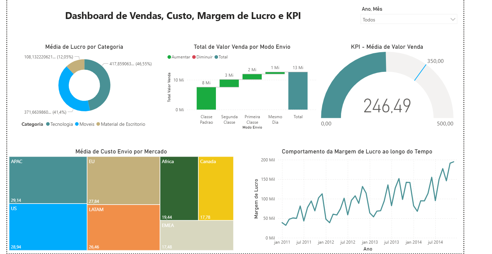

---

### 🧪 Lab 03: Financial Analytics e Estruturação de Balanço Patrimonial
**Arquivos:** [`Dashboard (.pbix)`](./Lab03/Lab3.pbix) | [`Visualização do Dashboard (.png)`](./Lab03/Lab3.png)

Este laboratório marca a transição para a análise de dados financeiros. O objetivo central é demonstrar como transpor demonstrações contábeis estáticas e tradicionais para um ambiente interativo, explorando as capacidades avançadas de hierarquia e formatação do visual de Matriz no Power BI.

**1. Contexto de Negócio**
Para a diretoria financeira (CFO) e analistas de controladoria, o Balanço Patrimonial é a fotografia da saúde da empresa. O grande desafio das empresas tradicionais é sair do "Excel estático" e ter uma visão dinâmica de seus Ativos (o que a empresa tem), Passivos (o que a empresa deve) e Patrimônio Líquido, permitindo navegar do macro (visão consolidada) para o micro (contas contábeis específicas) em poucos cliques.

**2. Conceito Teórico Essencial**
* **Engenharia de Dados Financeiros:** Estruturação de dados em formato de plano de contas (hierarquias de níveis contábeis).
* **Equação Fundamental da Contabilidade:** Garantir a integridade lógica onde $Ativos = Passivos + Patrimônio Líquido$ na modelagem e exibição dos dados.
* **Drill-down e Drill-up Analítico:** O conceito de navegação em profundidade de dados hierárquicos para investigação de anomalias financeiras.

**3. Aplicação Prática no Power BI**
* **Domínio do Visual de Matriz:** Configuração avançada da Matriz para suportar estruturas financeiras complexas.
* **Layout de Níveis (Stepped Layout):** Ajuste de formatação para simular a identação clássica de relatórios contábeis, tornando a leitura intuitiva para profissionais de finanças.
* **Controle de Subtotais e Totais:** Manipulação das configurações do visual para exibir subtotais apenas nos níveis hierárquicos corretos (ex: Total do Ativo Circulante, Total do Passivo Não Circulante).
* **Navegação Hierárquica:** Implementação de recursos de expansão e recolhimento (Drill-down/Drill-up) permitindo ao usuário investigar a composição de contas específicas sem perder o contexto global.
* **Formatação Condicional e Estilização:** Aplicação de regras de design e UX (User Experience) voltadas para relatórios executivos, garantindo clareza e sobriedade.

**4. Insight Analítico Gerado**
A entrega deste dashboard transforma a rotina de auditoria e análise financeira. O tomador de decisão passa a ter uma ferramenta interativa que não apenas consolida a posição patrimonial da empresa em tempo real, mas também permite identificar rapidamente gargalos de liquidez ou alavancagem excessiva ao descer o nível de granularidade das contas com um simples clique.

  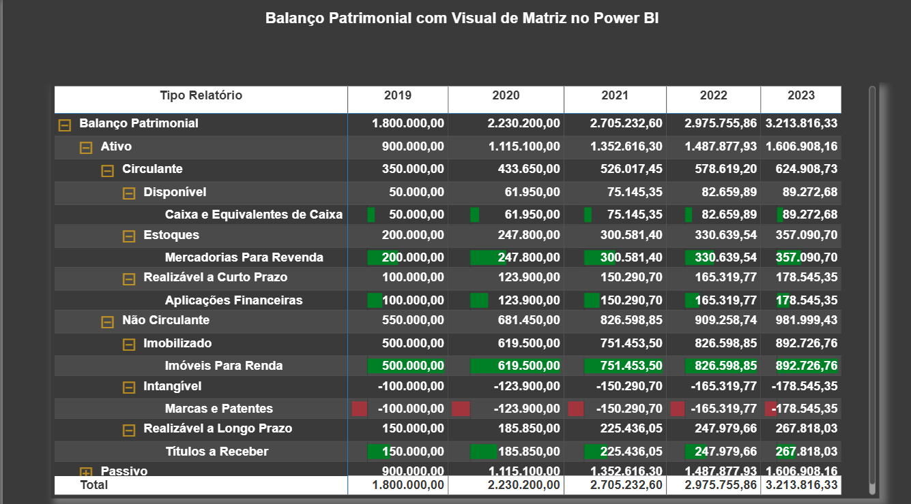

---

### 🚀 Projeto 01: Marketing Analytics e Comportamento do Consumidor
**Arquivos:** [`Dashboard (.pbix)`](./Projeto01/Projeto01.pbix)

Este é o primeiro projeto completo e estruturado do portfólio. Ele transcende a criação de gráficos isolados e apresenta uma solução robusta de **Business Intelligence aplicada ao Marketing**, composta por 4 painéis integrados. O objetivo é fornecer uma visão 360º da jornada do cliente, desde o seu perfil demográfico até a sua resposta às campanhas publicitárias.

**1. Contexto de Negócio**
O Diretor de Marketing (CMO) de uma empresa precisa otimizar o orçamento (Budget) das campanhas promocionais. Atirar para todos os lados custa caro e traz baixo retorno. O problema de negócio aqui é claro: **Quem é o nosso cliente ideal, o que ele compra e quais campanhas realmente funcionam?** Precisamos mapear o perfil do consumidor e cruzar isso com o volume de vendas e a aceitação das campanhas globais.

**2. Conceito Teórico Essencial**
* **Customer Analytics & Profiling:** Segmentação de clientes com base em variáveis demográficas (idade, renda, estado civil) e comportamentais (frequência de compra, recência).
* **Métricas de Efetividade:** Avaliação matemática de campanhas. Em Data Science aplicada ao marketing, frequentemente modelamos taxas de sucesso, como a Taxa de Conversão:
  $$Taxa\ de\ Convers\tilde{a}o = \frac{Total\ de\ Clientes\ que\ Compraram}{Total\ de\ Clientes\ Impactados\ pela\ Campanha}$$
* **Data Cleansing Avançado:** Identificação e tratamento de anomalias na base de dados (outliers, valores ausentes ou inconsistentes) que poderiam enviesar a análise das campanhas.

**3. Aplicação Prática no Power BI**
* **ETL e Correção de Dados:** Uso intensivo do Power Query para higienizar a base customizada, garantindo que as métricas reflitam a realidade.
* **Storytelling em 4 Visões (Páginas):**
  * **Visão do Cliente:** Foco em demografia (Renda, Escolaridade, Estado Civil).
  * **Visão do Comportamento de Compra:** Foco em transações (Ticket Médio, Volume por Categoria de Produto).
  * **Visão de Performance das Campanhas:** Foco em ROI e aceitação (Qual campanha teve maior adesão?).
  * **Visão de Padrões no PDV (País):** Foco geoespacial (Como os hábitos mudam de acordo com a região?).
* **Modelagem e DAX:** Criação de mais de 10 elementos visuais complexos, sustentados por medidas DAX customizadas para cruzar o perfil do cliente com o resultado financeiro.
* **UX/UI Design:** Aplicação de formatações avançadas, paleta de cores coesa e navegação fluida entre as 4 páginas do relatório para melhorar a experiência do usuário final.

**4. Insight Analítico Gerado**
A estrutura deste projeto permite à equipe de Marketing abandonar o "achismo". Ao cruzar a *Visão do Cliente* com a *Visão de Campanhas*, o negócio consegue identificar nichos hiper-específicos (ex: "Clientes casados, com alta renda, respondem 40% melhor à Campanha X no país Y"). Isso possibilita a criação de campanhas direcionadas, reduzindo o Custo de Aquisição de Clientes (CAC) e maximizando o retorno sobre o investimento.

#### 📸 Galeria do Projeto

<table align="center">
  <tr>
    <td align="center"><strong>Visão do Cliente</strong> 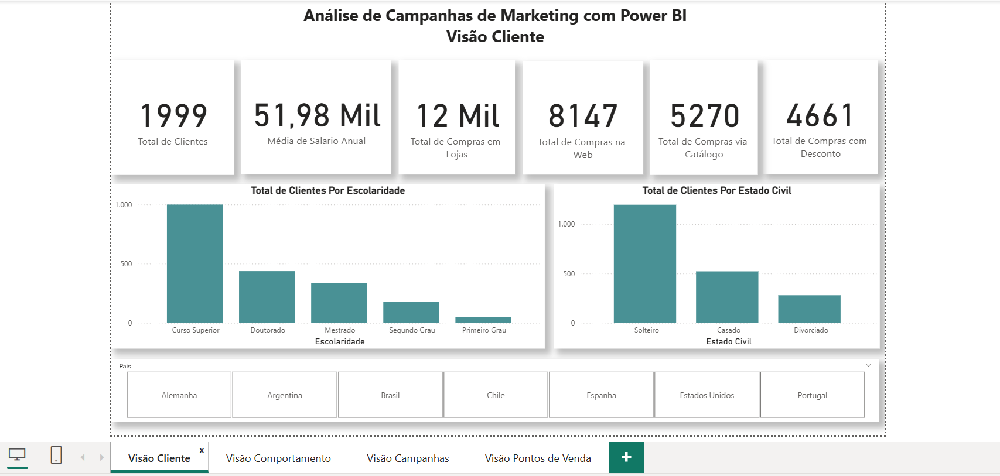</td>
    <td align="center"><strong>Visão do Comportamento</strong> 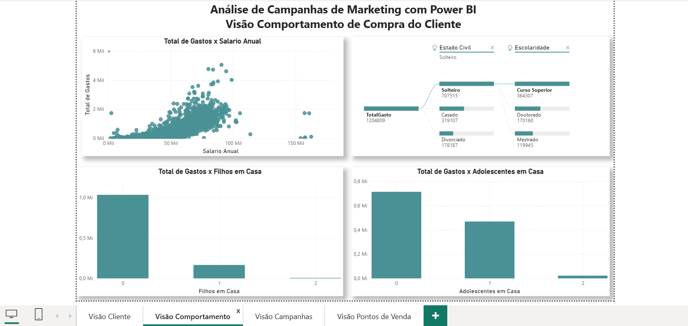</td>
  </tr>
  <tr>
    <td align="center"><strong>Visão das Campanhas</strong> 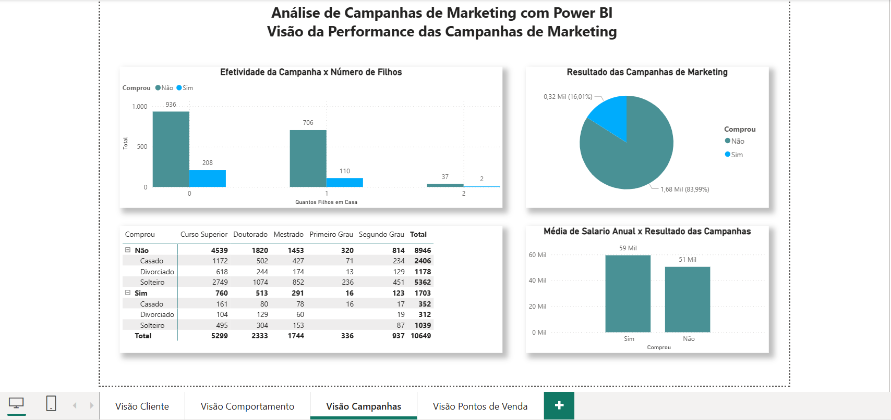</td>
    <td align="center"><strong>Visão do PDV (País)</strong> 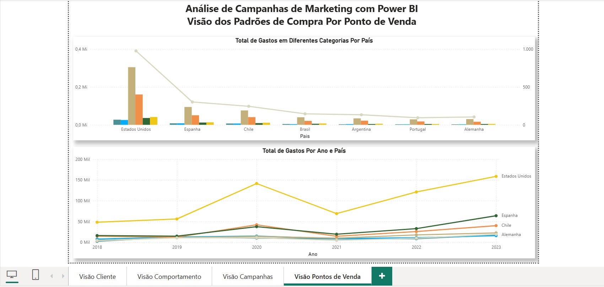</td>
  </tr>
</table>

---

### 🚀 Projeto 02: Inteligência Comercial e Augmented Analytics (Análise Aumentada)
**Arquivos:** [`Dashboard (.pbix)`](./Projeto02/Projeto02.pbix)

Neste projeto, elevamos a maturidade analítica saindo da análise puramente descritiva (o que aconteceu) para a **Análise Diagnóstica** (por que aconteceu). Utilizando dados comerciais de uma empresa fictícia, este painel aplica recursos de Inteligência Artificial integrados ao Power BI e foca na experiência do usuário (UX) através de navegação por menus.

**1. Contexto de Negócio**
O Diretor de Vendas (CSO - *Chief Sales Officer*) não tem tempo para procurar os motivos de uma queda ou alta no faturamento. Ele precisa que o painel lhe diga imediatamente quais fatores impulsionam os resultados e como o ranking de produtos flutua ao longo dos trimestres. O objetivo é responder: **O que influencia nosso sucesso e qual a narrativa por trás dos números?**

**2. Conceito Teórico Essencial**
* **Machine Learning & Probabilidade Condicional:** O visual de "Principais Influenciadores" roda modelos estatísticos (como Regressão Logística e Árvores de Decisão) no *backend* para calcular a probabilidade de um evento ocorrer dado um fator específico: $P(\text{Aumento nas Vendas} \mid \text{Fator}_X)$.
* **Natural Language Processing (NLP):** Geração de texto dinâmico a partir de dados estruturados para criar resumos executivos automáticos.
* **Análise de Volatilidade de Rankings:** Avaliação de como a posição competitiva de categorias ou produtos muda no eixo temporal.

**3. Aplicação Prática no Power BI**
* **UX/UI e Navegação Estruturada:** Criação de uma página de "Índice" (Menu principal) com o uso de *Bookmarks* (Indicadores) e Botões, permitindo uma navegação fluida estilo aplicativo (App-like experience) entre as visões do relatório.
* **Inteligência Artificial (Principais Influenciadores):** Implementação do visual de IA para descobrir automaticamente quais segmentos, regiões ou categorias puxam a métrica de vendas para cima ou para baixo.
* **Geração de Texto (Narrativa Inteligente):** Uso do visual de Narrativa para criar uma caixa de texto que se reescreve sozinha baseada nos filtros aplicados, destacando anomalias, picos e quedas.
* **Gráfico de Faixas (Ribbon Chart):** Utilizado não apenas para ver o volume financeiro, mas para visualizar a transição e a quebra de posições (Rankings) entre categorias de produtos ao longo dos meses.

**4. Insight Analítico Gerado**
Este projeto entrega um verdadeiro "assistente de vendas" ao gestor. Ao invés de o usuário ter que deduzir tendências visualmente, os algoritmos do painel apontam os direcionadores de lucro. Se a região "Sul" de repente se torna o principal influenciador de alta, a equipe comercial pode imediatamente replicar as estratégias dessa região para as demais. A navegação por botões garante que até o usuário menos técnico consiga extrair esse valor sem frustração.

#### 📸 Galeria do Projeto

<table align="center">
  <tr>
    <td align="center"><strong>Menu de Navegação (Índice)</strong> 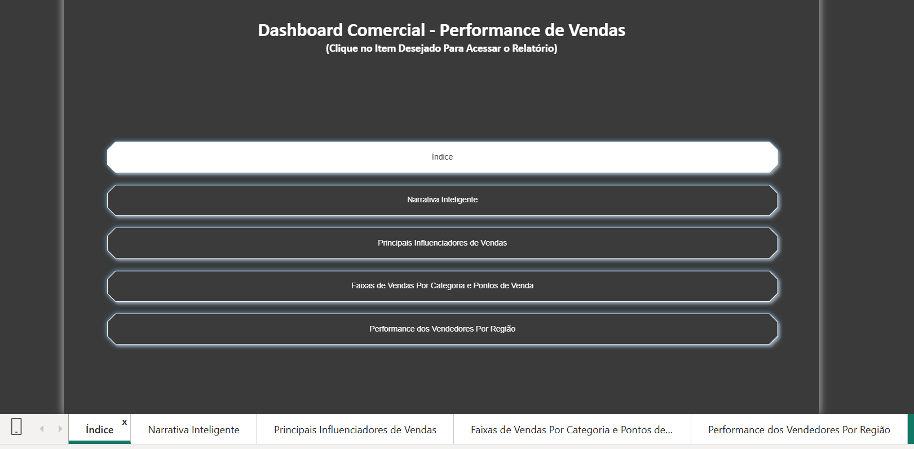</td>
    <td align="center"><strong>Visão Geral de Vendas</strong> 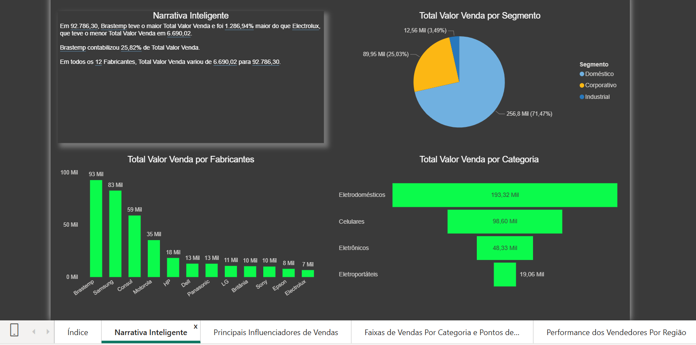</td>
  </tr>
  <tr>
    <td align="center"><strong>Gráfico de Faixas (Rankings Temporais)</strong> 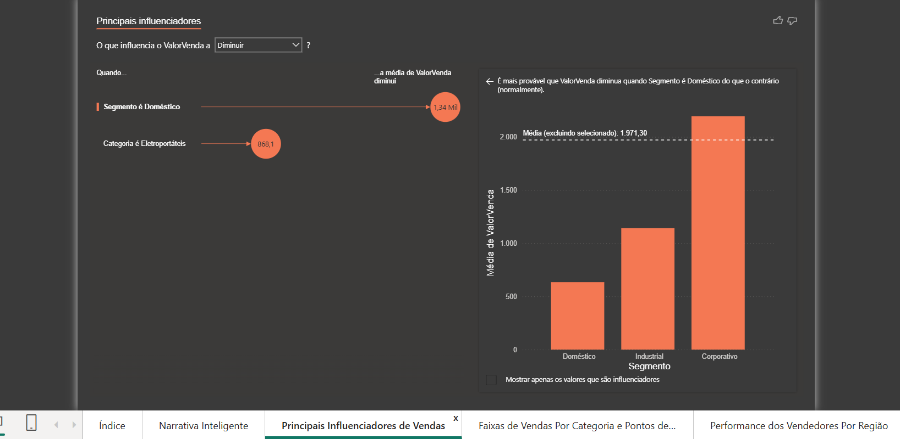</td>
    <td align="center"><strong>Principais Influenciadores (Machine Learning)</strong> 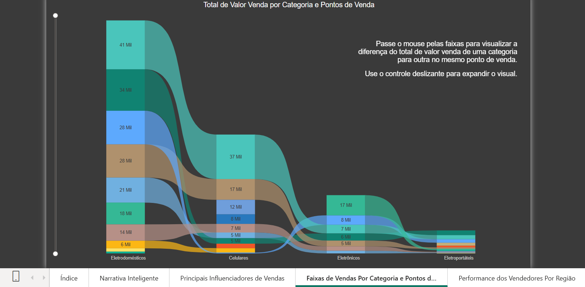</td>
  </tr>
  <tr>
    <td colspan="2" align="center"><strong>Narrativa Inteligente (Geração de Linguagem Natural - NLP)</strong> 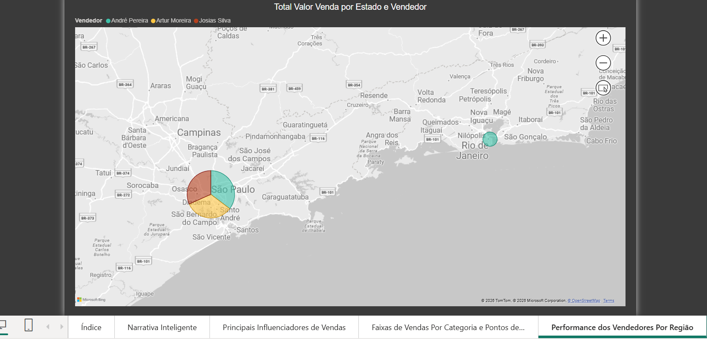</td>
  </tr>
</table>

---

### 🧑‍💼 Projeto 03: People Analytics e Gestão Estratégica de Talentos
**Arquivos:** [`Dashboard (.pbix)`](./Projeto03/Projeto03.pbix) | [`Visualização do Dashboard (.png)`](./Projeto03/projeto03.png)

Neste projeto, o foco é a área de Recursos Humanos. O objetivo é transformar dados operacionais de funcionários em inteligência estratégica, aplicando os conceitos de **People Analytics**. O projeto também destaca a maturidade no desenvolvimento em Power BI através da organização de arquitetura (Tabela de Medidas) e lógica de programação (Colunas Condicionais).

**1. Contexto de Negócio**
O Diretor de RH (CHRO) precisa de um panorama exato da força de trabalho atual para tomar decisões sobre políticas de diversidade, orçamento de folha de pagamento e planos de carreira. A empresa precisa mapear o nível de envolvimento das equipes, a disponibilidade para horas extras (impacto direto em custos operacionais e *Burnout*) e, principalmente, prever o orçamento para o próximo ciclo de promoções baseado em regras de negócio claras e justas.

**2. Conceito Teórico Essencial**
* **People Analytics & Demografia Organizacional:** Estudo do comportamento, experiência e distribuição demográfica da força de trabalho para otimizar a gestão de talentos.
* **Feature Engineering (Transformação de Variáveis Contínuas em Categóricas):** O processo de pegar um número absoluto (ex: Anos desde a última promoção) e transformá-lo em uma classe de decisão (Elegível / Não Elegível). Em estatística e programação, representamos essa lógica condicional (*Step Function*) da seguinte forma:
  $$Promo\c{c}\tilde{a}o(x) = \begin{cases} \text{Considerar Promo\c{c}\tilde{a}o}, & \text{se } x \ge 5 \\ \text{N\tilde{a}o Considerar}, & \text{se } x < 5 \end{cases}$$
  *(Onde $x$ é o número de anos desde a última promoção).*

**3. Aplicação Prática no Power BI**
* **Arquitetura de Medidas (Measures Table):** Abandono da prática amadora de espalhar medidas pelas tabelas do modelo. Criação de uma tabela virtual dedicada exclusivamente para centralizar e organizar o código DAX, facilitando a manutenção do sistema.
* **Lógica Condicional no Power Query/DAX:** Implementação de regras de negócio customizadas para criar a flag de "Elegibilidade para Promoção" (variável calculada fora do dashboard visual, mas essencial para o *backend* analítico).
* **Métricas de Capital Humano (KPIs):** Cálculos de *Headcount* (Total de funcionários), Tempo Médio de Experiência (Senhoridade da equipe) e Média Salarial Mensal.
* **Análise de Diversidade e Engajamento:** Estruturação de visuais para analisar a proporção de gênero na empresa, o nível de envolvimento dos colaboradores (segmentado em Ruim, Baixo, Médio e Alto) e a distribuição da força de trabalho por funções específicas.

**4. Insight Analítico Gerado**
Com este painel, o RH deixa de ser reativo e passa a ser preditivo. Ao cruzar o nível de envolvimento com o tempo médio de experiência e a disponibilidade para horas extras, a gestão pode identificar potenciais talentos sobrecarregados (risco de *Turnover*). Além disso, o cálculo exato do percentual de funcionários elegíveis para promoção permite à diretoria financeira (CFO) provisionar o orçamento do próximo ano com base em dados reais, e não em estimativas.

#### 📸 Visão Geral do Painel de RH

  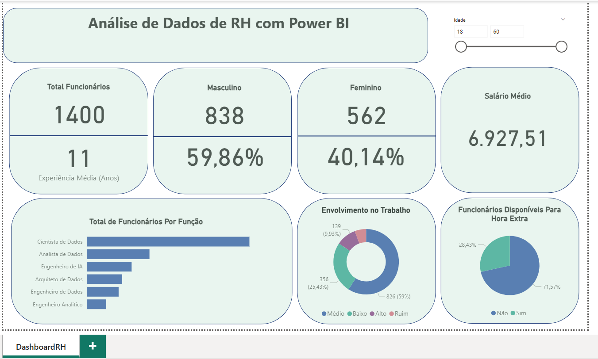

---

### 🚛 Projeto 04: Logistics Analytics e Refatoração de Dashboards (Troubleshooting)
**Arquivos:** [`Dashboard (.pbix)`](./Projeto04/Projeto04.pbix)

Este projeto traz uma abordagem incrivelmente realista e requisitada no mercado de trabalho: a **Auditoria e Refatoração de Projetos**. Em vez de construir do zero, o desafio foi receber um painel logístico herdado, repleto de más práticas de visualização e erros de cálculo, desconstruí-lo completamente e entregar uma solução sob os mais altos padrões de rigor analítico e design da informação.

**1. Contexto de Negócio**
A diretoria de *Supply Chain* (Cadeia de Suprimentos) de uma empresa de logística encomendou um painel para monitorar o status das entregas. O material entregue inicialmente estava confuso, induzia o usuário ao erro e falhava em destacar os gargalos. O objetivo foi atuar como um consultor interno: auditar os dados, justificar tecnicamente o *porquê* de a versão anterior estar errada e reconstruir a solução para que os gestores pudessem focar no que importa: prazos, atrasos e performance de equipes.

**2. Conceito Teórico Essencial**
* **Data Visualization & Carga Cognitiva:** Aplicação dos princípios de Edward Tufte (maximização do *Data-Ink Ratio*, ou seja, remover a poluição visual e focar na informação) e uso das leis da Gestalt para reduzir o esforço mental do usuário ao ler o dashboard.
* **Métricas de Nível de Serviço Logístico (SLA):** Em logística, rastreamos o desempenho através de indicadores estritos de conformidade. A proporção de entregas feitas dentro do prazo é o OTD (*On-Time Delivery*), modelado estatisticamente como:
  $$OTD = \frac{\sum Entregas\ no\ Prazo}{\sum Total\ de\ Entregas}$$
* **Auditoria de Dados (Data Auditing):** Investigação de falhas de agregação (como somar valores que deveriam ser médias) e uso incorreto de filtros implícitos.

**3. Aplicação Prática no Power BI**
* **Análise Crítica (Diagnóstico):** Mapeamento dos erros da versão original, como o uso indiscriminado de gráficos de pizza para muitas categorias (o que distorce a percepção de proporção), falta de ordenação (sort) e poluição de cores.
* **Desenvolvimento de KPIs de Precisão:**
  * **SLA de Canal:** Total de Entregas no Prazo fatiado por Canal de Entrega.
  * **Eficiência Operacional:** Percentual de Entregas Antecipadas por Equipe de Entrega.
  * **Análise de Tendência:** Total de Entregas por Mês (utilizando *Time Intelligence*).
  * **Filtros Avançados (Top N):** Configuração de filtro dinâmico no painel lateral para isolar as entregas apenas dos Top 5 Vendedores.
  * **Mapeamento de Gargalos:** Identificação de Entregas com Atraso por Cidade, usando gráficos de barras horizontais ordenados para facilitar a leitura.
  * **Visão Macro:** Percentual de Entregas segmentado de forma clara por Status.
* **Reconstrução de UI/UX:** Implementação de uma paleta de cores semântica (vermelho para atrasos, verde para antecipações, cores neutras para o contexto geral), alinhamento de grades (grids) e tipografia hierárquica.

**4. Insight Analítico Gerado**
A refatoração transformou um relatório inútil em uma **Torre de Controle Logístico**. Ao consertar os eixos e as métricas, os diretores agora não precisam adivinhar os números; eles identificam imediatamente quais cidades exigem intervenção de frota (devido aos atrasos) e quais equipes merecem bonificação pelo alto índice de entregas antecipadas. O projeto não apenas gerou gráficos bonitos, mas protegeu a empresa de tomar decisões operacionais catastróficas baseadas em dados mal interpretados.

#### 📸 O Poder da Refatoração (Antes vs. Depois)

<table align="center">
  <tr>
    <td align="center"><strong>❌ Versão Original (Com Erros de UX/UI e Modelagem)</strong> 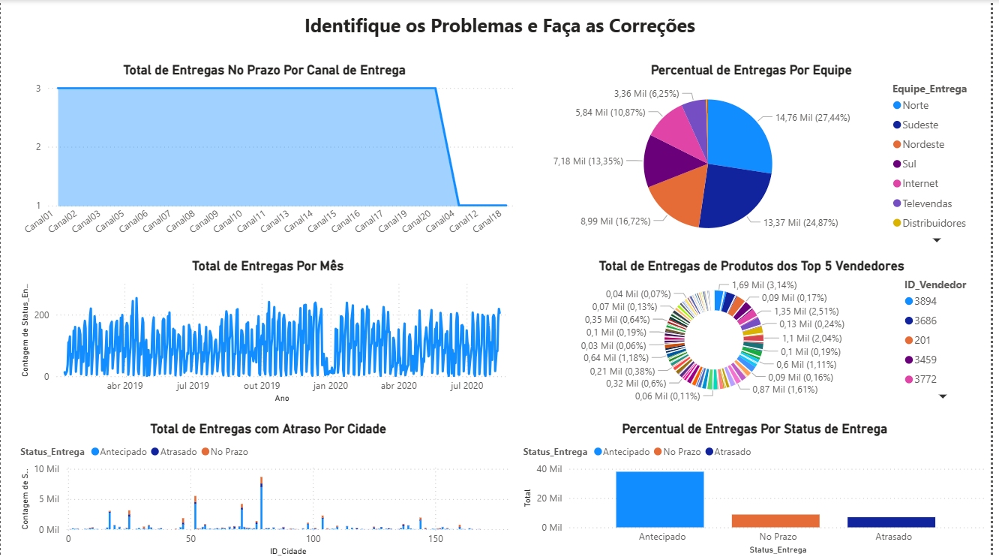</td>
    <td align="center"><strong>✅ Versão Refatorada (Padrão Profissional e Analítico)</strong> 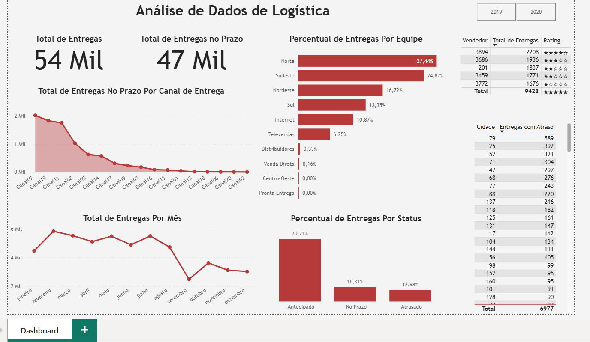</td>
  </tr>
</table>

---

### 📈 Projeto 05: Financial Analytics corporativo (FP&A) e Análise de Variância
**Arquivos:** [`Dashboard (.pbix)`](./Projeto05/Projeto05.pbix) | [`Visualização do Dashboard (.png)`](./Projeto05/Projeto05.png)

Neste projeto, aprofundamos o uso do Power BI no departamento de Controladoria e Planejamento Financeiro (FP&A). O objetivo é construir uma visão gerencial de Receitas e Despesas (semelhante a um DRE gerencial), focando não apenas em totais absolutos, mas em comparações de baseline (médias) e desdobramento hierárquico para dar suporte ao Plano Estratégico da empresa.

**1. Contexto de Negócio**
A diretoria financeira (CFO) quer ir além do simples fechamento contábil. Para traçar o plano estratégico do próximo ano, a liderança precisa responder a perguntas críticas: **Nossas despesas estão sob controle em relação à nossa média histórica? Quais componentes exatos estão corroendo nossa Margem de Lucro?** O painel precisa identificar cirurgicamente os extremos (maiores e menores segmentos) para direcionar cortes de custos ou alocação de investimentos.

**2. Conceito Teórico Essencial**
* **Análise de Variância (Variance Analysis):** A prática de comparar o desempenho atual contra um *baseline* (como uma média histórica, orçamento ou meta) para identificar desvios operacionais.
* **Rentabilidade (Profitability):** Modelagem matemática da eficiência do negócio. A margem é calculada dinamicamente via DAX:
  $$Margem\ de\ Lucro\ (\%) = \frac{\sum Receitas - \sum Despesas}{\sum Receitas}$$
* **Estrutura de Dados Hierárquica:** Organização de categorias financeiras em níveis (ex: Nível 1: Tipo -> Nível 2: Componente), permitindo o aprofundamento analítico (Drill-down).

**3. Aplicação Prática no Power BI**
* **Desenvolvimento de KPIs Financeiros:** Criação de cartões (*Cards*) de alto impacto visual para os indicadores primários: Total de Receitas, Total de Despesas e Margem de Lucro.
* **Composição de Receita:** Gráficos de distribuição para isolar o Total de Receitas por Componente, evidenciando o Princípio de Pareto (quais componentes trazem mais dinheiro).
* **Benchmarking Interno (Despesa vs. Média):** Implementação de visuais comparativos cruzando o Total de Despesas por Componente diretamente com a Média Global de Despesas. Isso cria uma "linha de corte" visual instantânea para anomalias.
* **Navegação Multidimensional (Drill-down):** Configuração de matrizes ou gráficos de barras suportando a hierarquia contábil (`Tipo > Componente`), cruzando essa estrutura com o eixo temporal (Ano) para análise de tendências de longo prazo.
* **Identificação de Extremos (Top/Bottom Performers):** Uso de ordenação avançada e formatação para destacar claramente os segmentos de maior sucesso e os de maior risco.

**4. Insight Analítico Gerado**
Este dashboard eleva a discussão nas reuniões de diretoria. Ao comparar as despesas de cada componente contra a média global, os gestores param de discutir opiniões e passam a discutir fatos (ex: "O Componente X está 40% acima da nossa média de gastos, precisamos de uma auditoria lá"). A visão hierárquica por ano permite entender se um aumento de despesa é sazonal ou uma tendência perigosa de longo prazo, fornecendo a base de dados perfeita para a revisão do Planejamento Estratégico.

#### 📸 Visão do Planejamento Financeiro

  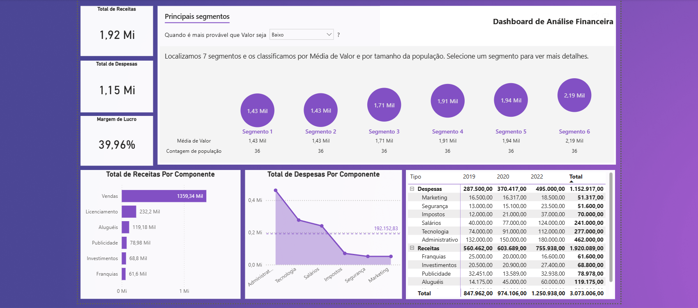

---

### 📈 Projeto 06: Stock Market Analytics e Análise de Séries Temporais
**Arquivos:** [`Dashboard (.pbix)`](./Projeto06/Projeto06.pbix) | [`Visualização do Dashboard (.png)`](./Projeto06/Projeto6.png)

Este projeto representa um salto significativo em complexidade e aderência ao mundo real, utilizando **dados públicos extraídos diretamente da NASDAQ**. O dashboard foi desenvolvido para atuar como uma ferramenta de *Equity Research* (Pesquisa de Ações), monitorando a liquidez e a volatilidade de 5 gigantes do mercado: IBM, Microsoft, Oracle, Tesla e Walmart.

**1. Contexto de Negócio**
Investidores, analistas de portfólio e *traders* precisam monitorar constantemente o comportamento das ações para tomar decisões de compra ou venda. A dor de negócio aqui é a sobrecarga de informações: analisar a variação de preço e o volume de múltiplas empresas simultaneamente é exaustivo. O objetivo deste painel é fornecer um monitoramento ágil, permitindo comparar o desempenho histórico das ações e identificar tendências de forma automatizada.

**2. Conceito Teórico Essencial**
* **Séries Temporais (Time Series):** Sequência de pontos de dados indexados em ordem cronológica. Em Data Science, analisar o mercado de ações exige lidar com flutuações, sazonalidade e tendências ao longo do tempo.
* **Métricas OHLC:** O padrão global de análise financeira para rastrear o preço de um ativo durante um período: *Open* (Abertura), *High* (Máxima), *Low* (Mínima) e *Close* (Fechamento).
* **Variação Temporal (MoM - Month-over-Month):** O cálculo de como o preço de fechamento evolui em relação ao mês imediatamente anterior, modelado matematicamente como:
  $$Varia\c{c}\tilde{a}o\ MoM = \frac{Fechamento_{M\hat{e}s\ Atual} - Fechamento_{M\hat{e}s\ Anterior}}{Fechamento_{M\hat{e}s\ Anterior}}$$

**3. Aplicação Prática no Power BI**
* **Extração de Dados Reais:** Conexão e tratamento de bases de dados reais da bolsa de valores (NASDAQ), lidando com a formatação estrita do mercado financeiro.
* **Time Intelligence (DAX):** Uso de funções avançadas de inteligência de tempo no Power BI para calcular agregações móveis, médias mensais e variações temporais de forma dinâmica, independentemente do filtro aplicado.
* **Análise de Liquidez e Volatilidade:** * Construção de gráficos de tendência para o Volume Negociado ao longo do tempo.
  * Estruturação de Tabelas/Matrizes contendo os valores médios de *Open, High, Low e Close* consolidados por mês.
  * Gráficos para monitorar a variação mês a mês do preço de fechamento.
* **Filtros de Contexto Cruzado:** Implementação de segmentadores (*Slicers*) que permitem ao usuário isolar a análise para um único *ticker* (empresa) ou criar combinações personalizadas (ex: comparar apenas Tesla vs. Microsoft).
* **Augmented Analytics (Narrativa Inteligente):** Implementação de algoritmos de *Natural Language Generation* nativos do Power BI para redigir resumos automáticos. O relatório "lê" o gráfico e escreve as principais características e tendências (picos, quedas e correlações) sem intervenção humana.

**4. Insight Analítico Gerado**
Este dashboard automatiza o trabalho de um analista júnior de investimentos. Através dos visuais dinâmicos e do DAX avançado, um gestor de fundos consegue rapidamente identificar qual ativo teve maior liquidez (volume) no último ano e analisar a volatilidade da variação de fechamento. A Narrativa Inteligente serve como um *briefing* imediato, poupando horas de redação de relatórios gerenciais e permitindo que o foco vá 100% para a estratégia de alocação de capital.

#### 📸 Painel Analítico do Mercado de Ações

  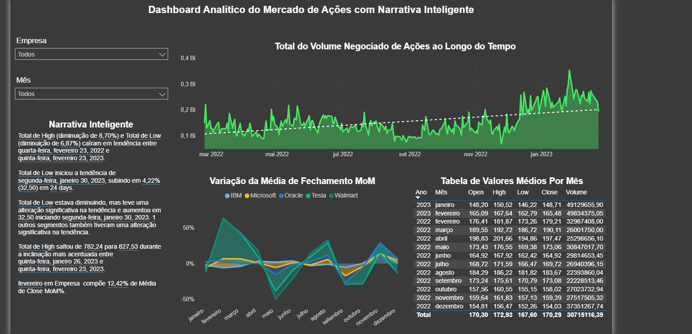

---

### 🧽 Lab 04: Data Cleansing, Qualidade de Dados e Tratamento de Outliers
**Arquivos:** [`Arquivo (.pbix)`](./Lab04/Lab4.pbix)

Este laboratório é um mergulho profundo na Engenharia de Dados dentro do ecossistema do Power BI (utilizando o Power Query e a Linguagem M). O foco abandona temporariamente a visualização de dados para focar na fundação de qualquer projeto analítico bem-sucedido: a **higienização e integridade da base de dados**.

**1. Contexto de Negócio**
A diretoria não pode tomar decisões baseadas em dados corrompidos. Valores ausentes podem subestimar o faturamento, registros duplicados podem inflar o número de clientes, e valores discrepantes (*outliers* — como um erro de digitação de uma venda de R$ 1.000.000,00 onde deveria ser R$ 1.000,00) destroem completamente o cálculo de médias e metas operacionais. O objetivo deste lab é atuar como um "Filtro de Qualidade", garantindo que apenas dados confiáveis cheguem à camada visual.

**2. Conceito Teórico Essencial**
* **Data Cleansing (Limpeza de Dados):** O processo de detectar e corrigir (ou remover) registros corrompidos, imprecisos ou irrelevantes de um *dataset*.
* **Imputação de Dados Ausentes:** Estratégias estatísticas para lidar com valores nulos, decidindo entre a exclusão da linha ou a imputação (preenchimento com a média, mediana ou um valor constante).
* **Detecção de Anomalias (Outliers):** Identificação de observações que se desviam drasticamente do padrão da amostra. Em estatística, frequentemente utilizamos o Método do Intervalo Interquartil (IQR) para definir as cercas de corte:
  $$IQR = Q3 - Q1$$
  $$Limite_{Superior} = Q3 + 1.5 \times IQR$$
  $$Limite_{Inferior} = Q1 - 1.5 \times IQR$$

**3. Aplicação Prática no Power BI**
* **Remoção de Duplicadas (Deduplicação):** Uso do Power Query para identificar chaves primárias repetidas e garantir a unicidade dos registros de transação.
* **Tratamento de Valores Ausentes (Null/Blank):** Aplicação de regras de substituição de valores e preenchimento condicional (*Fill Down/Up*) para tratar lacunas nos dados sem comprometer a volumetria da amostra.
* **Identificação Visual e Filtragem de Outliers:** * Construção de gráficos de dispersão (*Scatter Plots*) e gráficos de caixa (*Boxplots*) para isolar visualmente os pontos fora da curva.
  * Aplicação de filtros no nível de transformação (Power Query) ou usando DAX avançado para excluir matematicamente esses ruídos do cálculo das métricas principais.

**4. Insight Analítico Gerado**
A execução rigorosa destas três etapas constrói um modelo de dados blindado. O gestor que consome os painéis finais passa a ter **confiança absoluta** nos números. Ao tratar os outliers, por exemplo, o cálculo do "Ticket Médio" da empresa deixa de ser distorcido por anomalias sistêmicas, refletindo com precisão o verdadeiro comportamento de consumo da base de clientes.

#### 📸 Etapas de Transformação e Limpeza

<table align="center">
  <tr>
    <td align="center"><strong>Análise de Distribuição e Outliers</strong> 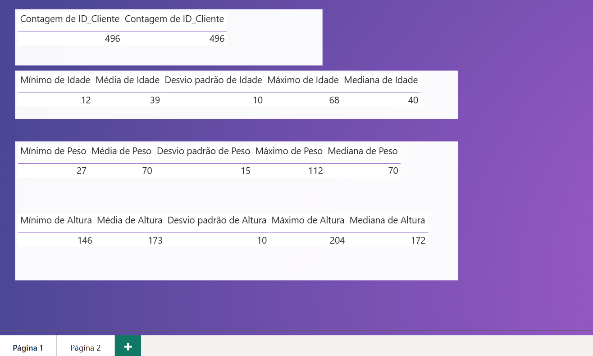</td>
    <td align="center"><strong>Tratamento e Higienização de Dados</strong> 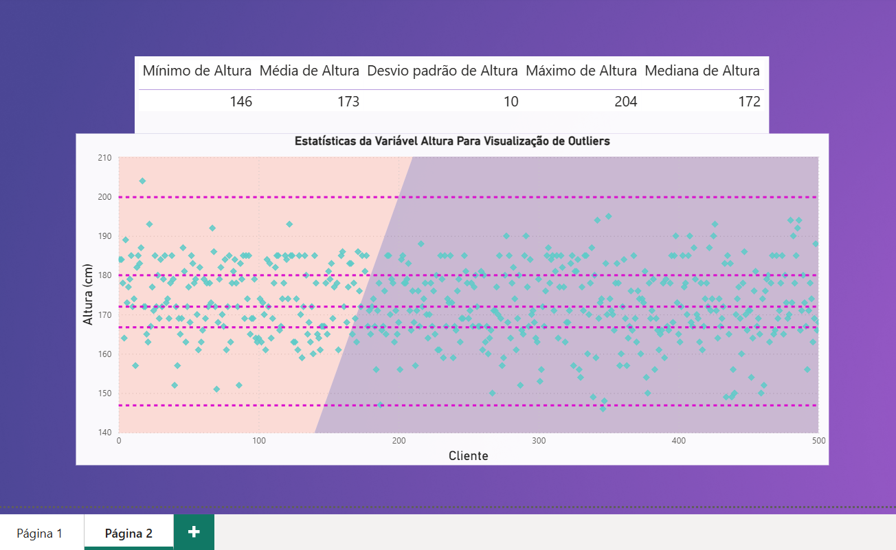</td>
  </tr>
</table>

---
